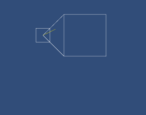

# Unity Code Explanations

## [Computing In-Bounds Random Asteroids Directions](AseteroidInstance.cs)
I made an Aseteroids game in the study course for the Unity Certified Programmer exam. I decided to challenge myself by calculating random movement directions such that, when an asteroid is destroyed and splits into smaller children, it always moves in towards the play space rather than potentially wrapping around the border. I made the following debug visualization to both test and clarify the concept:

The small square is the asteroid, the large square is the play space, the white lines or circle bound the range of directions, and the yellow lines are randomly generated directions.

## [AI Pathing Agent](PathingAgent.cs) & [Custom Inspector](PathingAgentEditor.cs)
While volunteering as a tools engineer on the magical wildlife photography game Beasts of Maravilla Island, I also did some AI work. The PathingAgent class is intended to enhance the NavMeshAgent component (although it can lerp around without one) by adding a waypoint set and the ability to fly or otherwise move off a NavMesh. Variance can be added to a waypoint path via a subset of random waypoints that the agent might wander among before reaching its overarching goal waypoint. It also supports swapping waypoint collections and the concept of a tether which the agent won't advance a certain distance from. The coolest thing about the custom inspector is it features nested reorderable lists for the waypoints, with the order determining the path. It also draws the waypoint path in the scene view, with each random waypoint subgroup toggleable visible, and has buttons for saving and loading waypoint collections.

## [3D Store Carousel UI](VendingCarousel.cs)
This 3D storefront carousel UI required fun modulo and angular math. The carousel can be freely spun, or an item can be directly selected and snapped to. It has configurable item spacing, spin speed, and inertia. Note that the items speed up to travel the longer distance around the back of the carousel in the same time.

## [Shaders](Shaders)
The four Unity CG shaders contained herein are a sampling of what I created while taking a Udemy course to expand my areas of expertise.

## [Tools](Tools)
These are some of my favorite custom inspectors and editor window tools I've expanded the Unity Editor with. I truly enjoy improving the process of making games.