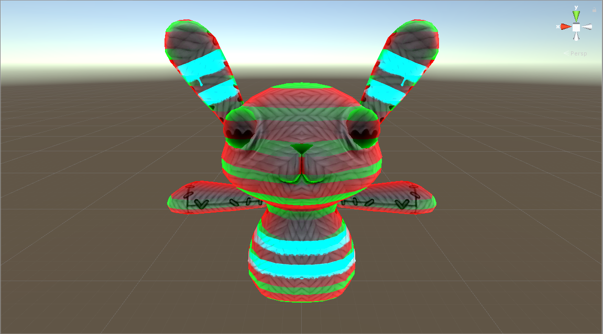
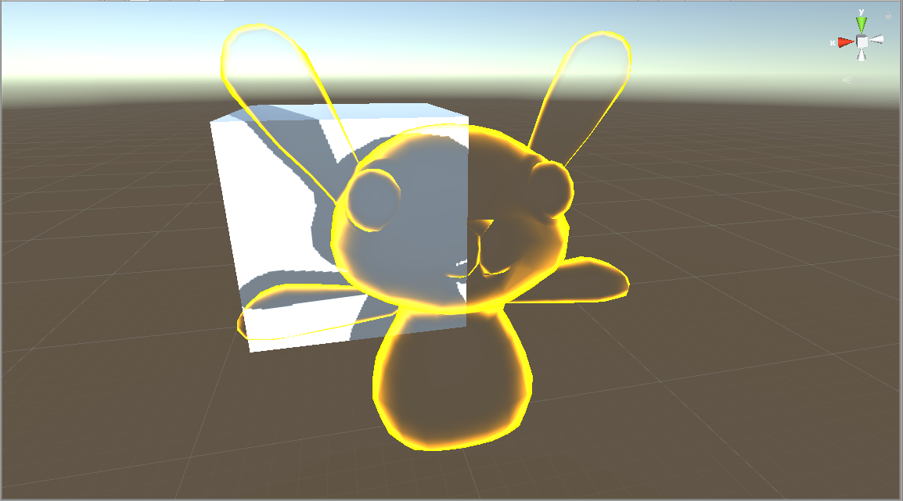
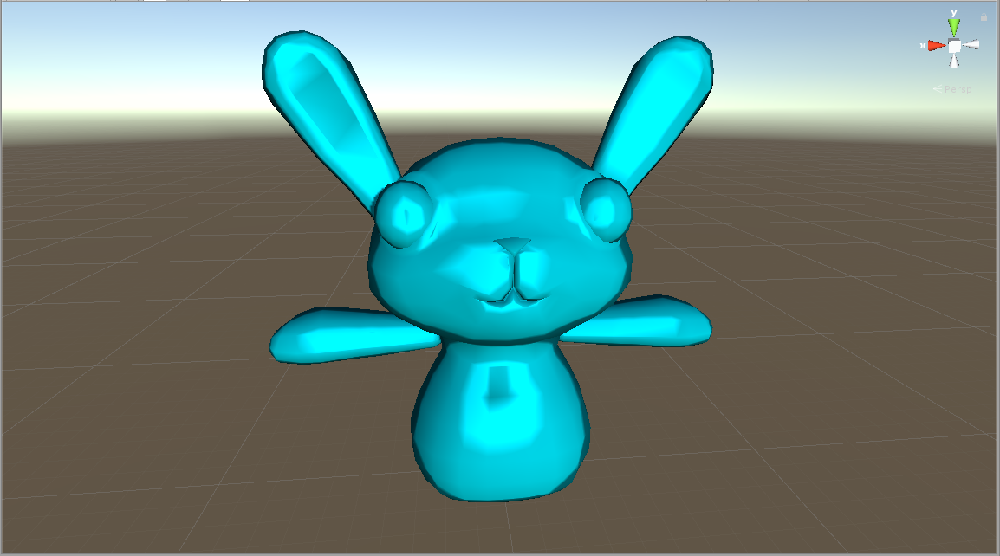
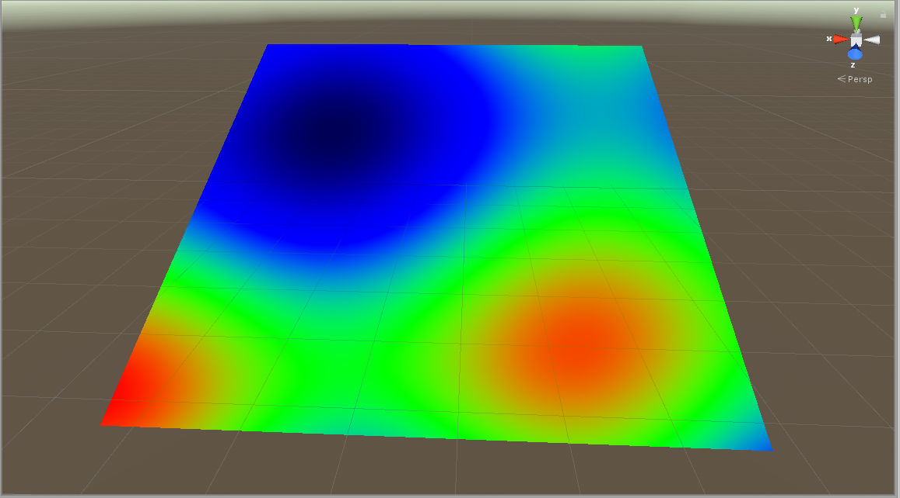

#Shader Code Explanations

##[Stripe Shader](CutoffWithDiffuse.shader)
This shader combines fresnel/rim lighting with world-position-y selective coloring to create translucent, emissive stripes over a texture.

##[Hologram Shader](Hologram.shader)
This two-pass shader uses transparency and fresnel/rim lighting to create a hologram effect.

##[Toon Shader](ToonRampSurface.shader)
This is a toon lighting shader where the view direction is transformed into UV coordinates on a black and white ramp texture.

##[Plasma Shader](VFPlasma.shader)
This shader varies its color channels over time via a bunch of trig functions to produce a plasma/lava lamp effect.

