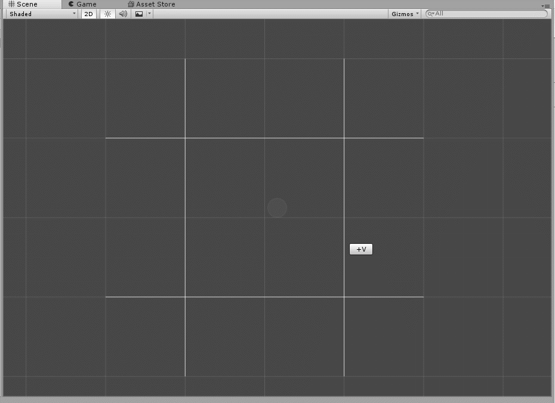
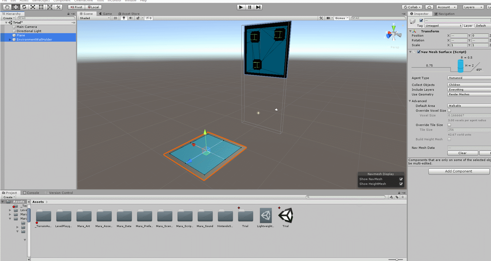
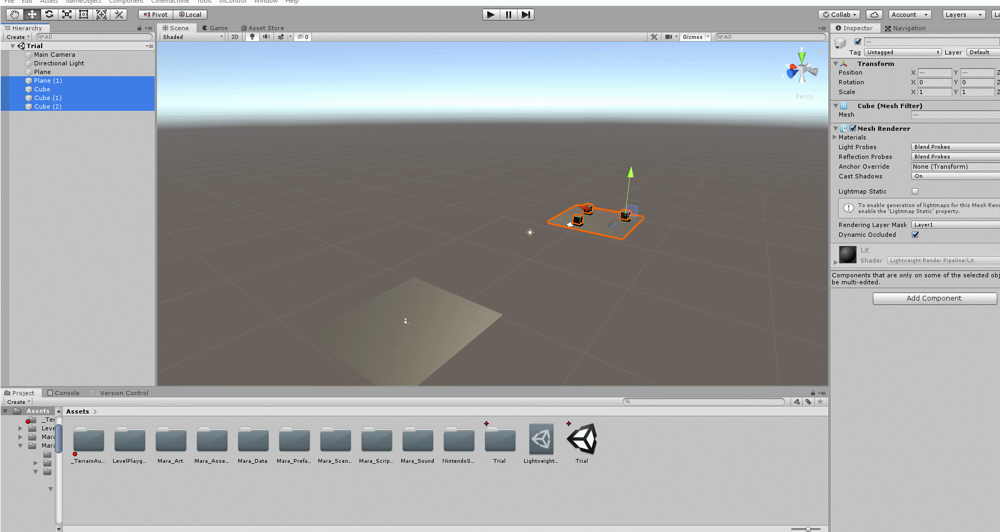
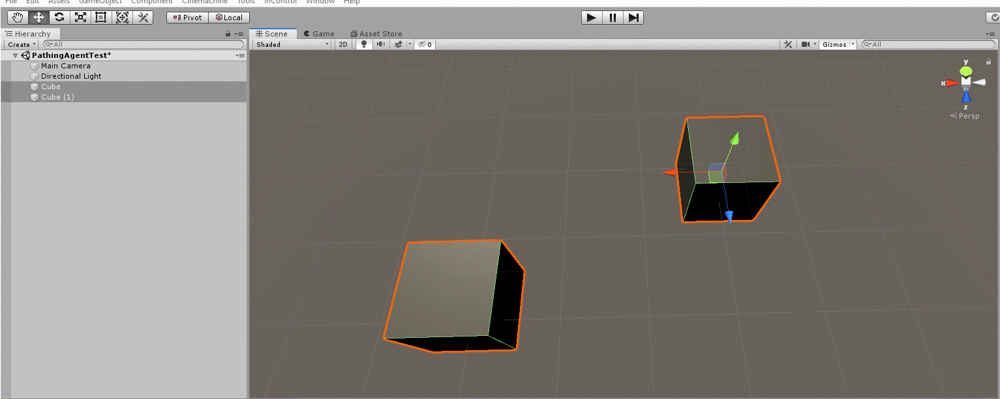

#Tools Code Explanations

##[Image Pixel-Based Level Generation](BlockLvlImgLoader.cs) & [Corresponding Functions](LvlGenFunctions.cs)
By specifying a mapping between a color value and a prefab and/or function, level designers can build up horizontal slices of a level from source images stacked on top of each other. The tool uses reflection to expose as options any public, static function in the file LvlGenFunctions.cs. I wrote functions for generating invisible walls, stairs, and ramps, the last of which required some fun exploration into shear transformation matrices.

##[Grid Layout Tool](XYGrid.cs) Composed of [Interactive Lines](InteractiveLine.cs)
The grid tool allows designers to arrange and bake a grid in the Scene View by adding and rearranging vertical and horizontal lines.

##[Automatic NavMesh Link Generation](PLG_AutoNavMeshLinkWizard.cs)
This wizard automates the process of setting up a NavMeshLink between two NavMeshSurfaces.

##[Keyed Camera Shot Sequence Custom Inspector](PLG_CamerSequenceEditor.cs) & [Editor Window](PLG_CameraSequenceAdjustWindow.cs)
This toolset empowers designers to create sequenced camera shots by keyframing a series of transforms (positions and rotations). The keys are stored in a ScriptableObject data blob whose custom inspector displays the keys in a reorderable list along with a camera preview. Additional keyframes can be grabbed from any camera, including the Scene View camera itself. The editor window portion provides preview playback and instantiates manipulable key stand-ins. The segments between keys can be made to lerp or curve.

##[Arbitrary Orientation NavMesh Rotater](PLG_NavMeshWallWizard.cs)
This wizard makes it easy to take advantage of Unity's NavMeshComponents plugin's support for arbitrarily rotated NavMeshes by automating the process of arranging the hierarchy and orientation of the desired surface.

##[Terrain Greyboxing from Boolean Mesh Operation Tool](PLG_TerrainGreyboxingWindow.cs)
Inspired by a similar tool from an Abzu GDC talk, this custom editor window generates a Unity Terrain by raycasting against selected meshes to union or subtract them by writing directly to the heightmap. It can also perform image processing on the heightmap to convolve a Gaussian kernel and blur/smooth the terrain.

